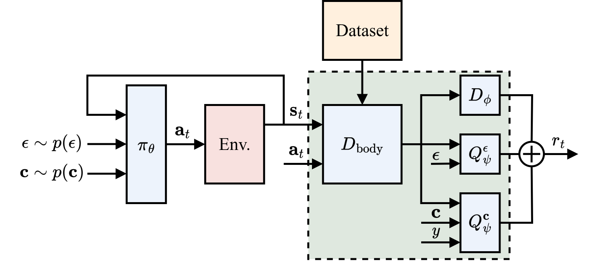

# Ess-InfoGAIL (NeurIPS 2023)

[Ess-InfoGAIL: Semi-supervised Imitation Learning from Imbalanced Demonstrations](https://openreview.net/pdf?id=jxhUNLoi4m)

This repository contains the PyTorch implementation of Ess-InfoGAIL, a method for imitation learning from **raw expert demonstrations** without the need for:

* Labeling behavior modes (e.g., human walking, running, jumping, etc.) for each data point.
* Extracting independent segments of behavior modes.
* Establishing a balanced distribution of data among behavior categories.

<p align="center"></p>

## Installation
To get started, create a new conda environment (optional) using the following command:
```bash
conda create -n [env_name] python=3.8
```

Next, install the external dependencies for this repository:
```bash
pip install -r requirements.txt
```

## Train a model
Before training Ess-InfoGAIL, we first train expert policies and then use them to collect expert demonstrations. In addition, it is also possible to directly use raw motion capture data without the need for training additional expert policies. In the following, we take the Reacher environment as an example.

### 1. Train expert
Run the following bash script to train the expert policy for each behavior mode:
```bash
bash run_expert.sh
```

### 2. Collect expert demonstrations
Use the expert policy to collect expert demonstrations for each behavior mode:
```bash
bash run_collect_demo.sh
```
The unlabeled expert demonstrations will be saved in `./buffers/Reacher-v4_6_modes_ulb`, and the labeled expert demonstrations will be saved in `./buffers/Reacher-v4_6_modes_lb`.

For 2D-Trajectory environment, we do not need to train expert policies. Run the following command to directly collect expert demonstrations:
```bash
python envs/traj_exp.py
```

### 3. Train classifier
To calculate the evaluation metrics NMI and ENT during the training process, a behavior mode classifier is pre-trained based on the expert demonstrations:
```
python train_classifier.py --env_id Reacher-v4 --num_modes 6 --epochs 20
```

### 4. Train Ess-InfoGAIL
An agent is trained to mimic the multi-modal expert demonstrations based on the generated files from steps 1-3:
```
python train_imitation.py --idx 1 --env_id Reacher-v4 --num_modes 6 --num_steps 2000000 --reward_t_coef 0.005 --seed 9
```

## Run a trained model
A pre-trained model can be run using the following command:
```
python train_imitation.py --env_id Reacher-v4 --num_modes 6 --model_path ./weights/Reacher-v4_6_modes_results/model.pth --rend_env True
```

## Citation
If you find our work useful, please cite our paper:
```
@inproceedings{ess-infogail2023,
  title={Ess-InfoGAIL: Semi-supervised Imitation Learning from Imbalanced Demonstrations},
  author={Fu, Huiqiao and Tang, Kaiqiang and Lu, Yuanyang and Qi, Yiming and Deng, Guizhou and Sung, Flood and Chen, Chunlin},
  booktitle={Advances in Neural Information Processing Systems (NeurIPS)},
  year={2023}
}
```

## Acknowledgement
We appreciate the following github repos a lot for their valuable codebase implementations:

- The basic GAIL and SAC implementation was taken from https://github.com/toshikwa/gail-airl-ppo.pytorch
- The calculation of NMI and ENT was taken from https://github.com/utkarshojha/elastic-infogan


